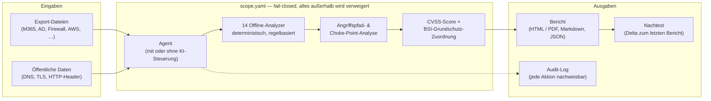

<p align="center">
  <picture>
    <source media="(prefers-color-scheme: dark)" srcset="docs/brand/specter-logo-white-transparent.png">
    
  </picture>
</p>

<h3 align="center">Findet die Schwachstellen, über die Unternehmen wirklich kompromittiert werden — bevor Schaden entsteht.</h3>

<p align="center"><strong>Die defensive Security-Plattform für den Mittelstand.</strong><br>
E-Mail-Betrug, offenes RDP, fehlende Backups: Specter deckt die Angriffspfade auf, erklärt sie verständlich und belegt jeden Fund.</p>

<p align="center">
  
  
  
  
  
</p>

<p align="center">
  
</p>

> **Rein defensiv:** keine Angriffe, kein Eingriff in fremde Systeme, nur im schriftlich vereinbarten Rahmen (§ 202 StGB). Eine Prüfung darf nie selbst zum Risiko werden — deshalb ist Specter von Grund auf so gebaut.

---

## Warum Specter — in fünf Sekunden

Die großen Plattformen (EDR, Cloud Security, SIEM) **überwachen den laufenden Betrieb** — sie schlagen Alarm, *während* ein Angriff passiert. Specter setzt **davor** an: Es findet die Fehlkonfigurationen und Versäumnisse, über die der Angriff überhaupt erst möglich wird — und liefert einen Bericht, den auch die Geschäftsführung versteht.

|  | **Specter** | Typische Enterprise-Plattform (EDR / Cloud Security) |
|---|---|---|
| **Aufgabe** | Prävention: Angriffspfade finden und schließen, *bevor* etwas passiert | Detektion: laufende Angriffe erkennen und stoppen |
| **Zielgruppe** | Mittelstand ohne eigenes Security-Team | Konzerne mit SOC und Security-Budget |
| **Eingriff ins System** | Keiner — offline, lesend, keine Agenten | Agenten auf jedem Endpoint, Dauerbetrieb |
| **Ergebnis** | Verständlicher Bericht mit Prioritäten, CVSS und BSI-Zuordnung | Dashboards und Alerts für Spezialisten |
| **Rechtsrahmen** | Fail-closed Scope, Audit-Log, § 202 StGB dokumentiert | Vom Betreiber selbst zu verantworten |
| **Kosten** | Einzelne Prüfung statt Lizenz pro Endpoint | Laufende Abo-Kosten pro Gerät/Nutzer |

**Kein Entweder-oder:** Specter ersetzt kein EDR — es beantwortet die Frage, die davor kommt: *„Wo sind wir gerade angreifbar, und was beheben wir zuerst?"* Genau diese Frage bleibt im Mittelstand meist unbeantwortet, bis es zu spät ist.

---

## Was ist Specter?

Specter ist eine **automatische, defensive Sicherheitsprüfung**. Man kann sich das
wie einen **unabhängigen Sicherheits-Check für die IT** vorstellen: Er schaut sich die IT einer Firma an, findet
Schwachstellen und schreibt einen verständlichen Bericht mit klaren Prioritäten — so
wie es große Sicherheitsfirmen tun, nur schneller und günstiger.

Das Besondere: Specter arbeitet **offline**. Er wertet Export-Dateien aus, die der
Kunde bereitstellt, und öffentliche Daten (z. B. DNS-Einträge). Er verbindet sich
nicht heimlich mit fremden Systemen und verändert dort nichts. Das macht ihn sicher —
und rechtlich sauber.

## So sieht es aus

**Der End-to-End-Lauf im Terminal** (echte Ausgabe der mitgelieferten Demo):

<p align="center"></p>

**Der fertige Bericht** (markengerechtes HTML, per Browser-Druck als PDF an den Kunden — [Beispielbericht als PDF](docs/Specter-Beispielbericht.pdf)):

<p align="center"></p>

▶️ **Der komplette Lauf als animierte Live-Demo:** [**docs/demo.html**](https://beko2210.github.io/Specter-/demo.html) — Aufklärung, Code-Scan, 14 Analyzer, Angriffspfade und Bericht in wenigen Sekunden. Oder selbst starten: `python examples/run_demo.py`.

---

## Beweise statt Behauptungen

Sicherheitssoftware verspricht viel. Specter ist so gebaut, dass jede Aussage **nachprüfbar** ist — von jedem, in Minuten, auf dem eigenen Rechner:

1. **Jeder Fund trägt seinen Beweis.** Die Analyzer arbeiten deterministisch und regelbasiert: Zu jedem Fund gehören die konkrete Evidenz (der DNS-Eintrag, der Header, die Firewall-Regel), ein CVSS-Score und die BSI-IT-Grundschutz-Zuordnung. Kein Fund ohne Beleg — dieselben Eingaben liefern denselben Bericht. Das hält die False-Positive-Diskussion kurz: Was im Bericht steht, lässt sich zeigen.

2. **Messbare Erkennungs- und Falsch-Positiv-Rate.** Statt einer erfundenen Marketing-Quote misst Specter gegen einen **offengelegten, reproduzierbaren Korpus**: 64 markierte Szenarien über alle 14 Analyzer mit bekanntem Soll-Ergebnis. Das Resultat — **176/176 gepflanzte Lücken erkannt (Recall 100 %), null Fehlalarme (Präzision 100 %)** auch auf 23 gehärteten und adversarialen Täuschungs-Szenarien. Selbst nachrechnen (Millisekunden):
   ```bash
   python examples/benchmark/run.py
   ```
   → [Methodik & Ergebnis](docs/BENCHMARK.md) · [Korpus](examples/benchmark/corpus.py). Der Korpus ist bewusst *schwer* gebaut (Werte exakt auf der Schwelle, numerischer Versionsvergleich, semantische Täuschungen wie „öffentlicher 443-Port ist legitim", schmutzige Exporte mit `"false"`/`"8"` als Strings) und läuft als Gate bei jedem Commit mit.

3. **Geprüft gegen echte Server, nicht nur Fixtures.** Die mitgelieferten Labore starten reale, absichtlich verwundbare Systeme und weisen nach, dass Specter die Schwachstellen findet — siehe [Labor-Beweise](#labor-beweise-selbst-nachprüfbar) unten.

4. **Specter prüft sich selbst.** Der Self-Audit setzt Specter auf den eigenen Quellcode an — derselbe Ablauf, den auch ein Kunde bekommt:
   ```bash
   python examples/self_audit.py
   ```

5. **791 Tests, 100 % Coverage, als Gate erzwungen.** Nicht als Ziel, sondern per `--cov-fail-under=100` in der CI auf Python 3.11 und 3.12 — ein Commit, der die Abdeckung senkt, kommt nicht durch.

6. **Nachtest mit Delta.** Nach der Behebung zeigt der zweite Lauf schwarz auf weiß, was geschlossen wurde — der messbare Nutzen steht im Bericht, nicht im Prospekt.

### Labor-Beweise (selbst nachprüfbar)

Das Labor-Harness mintet ein echtes (abgelaufenes, selbstsigniertes) TLS-Zertifikat,
startet damit einen echten HTTPS-Server mit absichtlich fehlenden Sicherheits-Headern
und einem unsicheren Cookie, greift ihn real ab (`curl` + `openssl`) und prüft, dass
Specter die Schwachstellen findet:

```bash
python examples/live_lab/run_lab.py
```

<p align="center"></p>

Denselben Live-Check kannst du gegen eine **eigene, freigegebene Domain oder einen
eigenen Server** laufen lassen (nur eigene/freigegebene Systeme — § 202 StGB):

```bash
python examples/live_web_check.py meine-domain.de
```

Und gegen eine **echte, selbst gestartete Datenbank**: das DB-Labor startet einen
echten, nicht authentifizierten Redis-Dienst (echter `redis:alpine`-Container,
sonst ein echter lokaler Socket-Dienst als Fallback), verbindet sich real per
Socket und prüft, dass Specter den offenen, ungeschützten Datenbank-Port erkennt:

```bash
python examples/live_lab/run_db_lab.py
```

Und gegen eine **echte Container-Konfiguration**: das Container-Labor erfasst per
`docker inspect` die echte Konfiguration eines absichtlich unsicheren Containers
(privilegiert, `docker.sock` gemountet, Host-Networking) und prüft, dass Specter
die gefährlichen Fehlkonfigurationen erkennt:

```bash
python examples/live_lab/run_container_lab.py
```

### Benchmark: Erkennung mit Zahl statt Behauptung

Wo die Labore *einzelne* echte Systeme prüfen, misst die Benchmark die
Analyzer-Logik **in der Breite** — gegen einen offengelegten Korpus aus 64
markierten Szenarien mit bekanntem Soll-Ergebnis:

```bash
python examples/benchmark/run.py
```

| Kennzahl | Wert |
|---|---|
| Abgedeckte Analyzer | **14 / 14** |
| Gepflanzte Lücken erkannt (Recall) | **176 / 176 = 100 %** |
| Fehlalarme (auf 23 gehärteten/Täuschungs-Szenarien) | **0 → Präzision 100 %** |
| Schweregrade korrekt | **100 %** |

Der Korpus ist bewusst **adversarial**: Werte liegen exakt auf der
Entscheidungsschwelle, Versionsvergleiche sind numerisch statt alphabetisch
(`2.9.0 < 2.10.0` **muss** greifen), und Täuschungen wie ein *legitimer*
öffentlicher 443-Port oder eine *deaktivierte* Conditional-Access-Richtlinie
dürfen nicht zu Fehlalarmen führen. Details: [`docs/BENCHMARK.md`](docs/BENCHMARK.md).

---

## Architektur

Vom Kundendaten-Export bis zum unterschriftsreifen Bericht — mit dem Scope als
technisch erzwungener Grenze um alles herum:



Ohne KI-Schlüssel laufen die Analyzer direkt; mit Schlüssel steuert das KI-Modell den
Ablauf — die Funde selbst kommen in beiden Fällen aus denselben deterministischen Regeln.

---

## Schnellstart

Einmalig einrichten:

```bash
git clone https://github.com/BEKO2210/Specter-.git
cd Specter-
pip install -r requirements.txt          # inkl. optionalem KI-Lauf
# oder nur der defensive Offline-Kern (ohne KI-Abhängigkeit):
# pip install -r requirements-core.txt
```

> Der **Offline-Kern** (alle 14 Analyzer, Report, Scope-Policy, Benchmark, Labore)
> läuft ohne KI-Abhängigkeit. Das Paket `anthropic` wird nur für den optionalen,
> KI-gesteuerten Lauf gebraucht. Mit modernem Packaging: `pip install .` (Kern) bzw.
> `pip install .[ai]` (mit KI).

**1) Demo ansehen** — kompletter Ablauf gegen einen lokalen Test-Server, völlig gefahrlos:

```bash
python examples/run_demo.py
```

**2) Live-Check einer echten Domain** — der kostenlose Türöffner (nur öffentliche DNS-Daten):

```bash
python examples/live_email_check.py kunde-domain.de
```

**3) Tests laufen lassen** — 626 Tests, 100 % Coverage:

```bash
pip install -r requirements-dev.txt
python -m pytest
```

---

## Schritt für Schritt: dein erster Kundenauftrag

> 📘 **Ausführlich mit Erklärungen im Handbuch:** [**Specter-Handbuch.pdf**](docs/Specter-Handbuch.pdf)
> (erzeugen/aktualisieren mit `python examples/build_handbook.py`).

1. **Türöffner senden.** Läuft den Live-Check für die Domain des Interessenten und
   nutze das Ergebnis als Aufhänger für den Erstkontakt:
   ```bash
   python examples/live_email_check.py kunde-domain.de
   python examples/build_outreach_email.py kunde-domain.de "Belkis Aslani" belkis.aslani@gmail.com
   ```
2. **Rahmen festlegen.** Trage die erlaubten Ziele/Pfade in eine `scope.yaml` ein
   (Vorlage: `scope.example.yaml`). **Nur was hier steht, wird geprüft** — alles andere
   verweigert Specter automatisch.
3. **Kundendaten sammeln.** Bitte die IT um harmlose **Export-Dateien** (JSON): E-Mail-/
   DNS-Einträge, Microsoft-365-/AD-Export, Firewall-Regeln, Backup-Fragebogen … In
   `examples/data/` liegt für jeden Bereich eine Beispieldatei zum Zeigen.
4. **Prüfen.** Ohne KI-Schlüssel laufen die Analyzer direkt; mit Schlüssel steuert das
   KI-Modell den Ablauf:
   ```bash
   python main.py --scope scope.yaml --objective "Prüfe die Exporte in ./kundendaten"
   ```
5. **Bericht & PDF.** Specter schreibt Markdown-, JSON- und einen schönen HTML-Bericht.
   HTML im Browser öffnen → **Drucken → Als PDF speichern** → fertiges Kunden-PDF.
6. **Angebot & Abschluss.** Angebots-One-Pager erzeugen und mitschicken:
   ```bash
   python examples/build_offer.py "Kunde GmbH" belkis.aslani@gmail.com
   ```
7. **Nachtest.** Nach der Behebung erneut prüfen — der Bericht zeigt, was jetzt
   geschlossen ist.

---

## Was Specter verhindert

Die drei teuersten Schadensfälle im Mittelstand beginnen fast immer gleich:
**CEO-Fraud** über gefälschte Absender, **Ransomware** über offenes RDP oder fehlende MFA,
und der **Totalverlust**, wenn nach dem Vorfall kein brauchbares Backup da ist.
Vierzehn Offline-Analyzer decken genau diese Einfallstore ab:

| Bereich | Findet u. a. |
|---|---|
| **E-Mail-Schutz** | SPF, DKIM, DMARC gegen Spoofing & CEO-Fraud |
| **DNS-Sicherheit** | fehlendes DNSSEC, fehlende CAA, offener Zonentransfer (AXFR), dangling CNAME |
| **Web-Sicherheit** | fehlende HTTP-Header (HSTS/CSP/X-Frame), unsichere Cookies, Banner-Leaks |
| **Datenbanken** | öffentlich erreichbare DB-Ports, fehlende Authentifizierung (Redis/Mongo), Default-Creds, Transport ohne TLS |
| **Container/Docker** | privilegierte Container, gemountetes docker.sock, Host-Networking, gefährliche Capabilities, Lauf als root, `:latest` |
| **Active Directory** | schwache Policies, Kerberoasting, Golden-Ticket-Risiken |
| **Microsoft 365 / Entra** | fehlende MFA, Legacy-Auth, zu viele Admins, offene Freigaben |
| **AWS** | Root ohne MFA, offene S3-Buckets, zu weite Rechte |
| **Azure** | öffentliche Speicher, offene Ports, alte VMs, ungeschützte Key Vaults |
| **Firewall & VPN** | Any-Any-Regeln, offenes RDP/SSH, VPN ohne MFA |
| **TLS & Zertifikate** | abgelaufen, schwache Cipher, alte Protokolle |
| **Abhängigkeiten (SCA)** | bekannte Lücken (Log4Shell-Klasse), veraltete Pakete |
| **Exchange** | veraltete Versionen, exponierte Dienste |
| **Backup-Resilienz** | 3-2-1-Regel, Immutable-Backups, getestete Restores |

Dazu: automatische **Angriffspfad-Analyse**, **Choke-Points**, ein **CVSS-Score** je
Fund, **BSI-IT-Grundschutz**-Zuordnung und ein **Nachtest** (Delta gegen den letzten Bericht).

---

## Sicherheit & Recht (die goldene Regel)

Eine Prüfung darf nie selbst zum Risiko werden. Deshalb ist Specter von Grund auf
defensiv gebaut:

- **Offline & lesend** — nur bereitgestellte/öffentliche Daten, keine Live-Verbindung.
- **Keine Ausnutzung** — kein Passwortknacken, keine Rechteausweitung, kein DoS, keine Persistenz.
- **Fail-closed Scope** — alles außerhalb der `scope.yaml` wird technisch verweigert.
- **Aktive Scanner standardmäßig aus** — nmap/nikto nur mit ausdrücklicher Freigabe (Human-in-the-loop).
- **Vollständiges Audit-Log** — jede Aktion ist nachweisbar.
- **Nur mit schriftlicher Beauftragung** — im vereinbarten Rahmen (§ 202a-c StGB), DSGVO-konform.

### Trust Center

Alles, was ein Kunde oder Partner vor der Beauftragung prüfen will, an einem Ort:

| Dokument | Inhalt |
|---|---|
| [`SECURITY.md`](SECURITY.md) | Sicherheitsmodell, Meldeweg für Schwachstellen |
| [Benchmark-Methodik](docs/BENCHMARK.md) | Wie Erkennungs- und Falsch-Positiv-Rate gemessen werden |
| [Beispielbericht (PDF)](docs/Specter-Beispielbericht.pdf) | So sieht das Ergebnis aus — vor dem Kauf |
| [Live-Demo (animiert)](https://beko2210.github.io/Specter-/demo.html) | Der End-to-End-Lauf als Screencast |
| [Handbuch (PDF)](docs/Specter-Handbuch.pdf) | Vollständige Bedienungs- und Lernunterlage |
| [Live-Demo-Skript](docs/Specter-Live-Demo-Skript.md) | Reproduzierbare Demo für Kundengespräche |
| [Datenschutz](docs/datenschutz.html) · [Impressum](docs/impressum.html) | Rechtliche Pflichtangaben der Website |

---

## Verkaufs-Kit (fertig zum Einsatz)

| Werkzeug | Zweck | Befehl |
|---|---|---|
| **Website** | Online-Auftritt (GitHub Pages) | `docs/index.html` |
| **Handbuch** | dein Lern-/Bedienheft (PDF) | `python examples/build_handbook.py` |
| **Benchmark** | Erkennungsrate belegen | `python examples/benchmark/run.py` |
| **Live-Demo** | animierter End-to-End-Lauf | `docs/demo.html` |
| **Live-Check** | kostenloser Türöffner | `python examples/live_email_check.py <domain>` |
| **Erstkontakt-Mail** | individuelle Ansprache | `python examples/build_outreach_email.py <domain>` |
| **Angebot** | Pakete & Preise | `python examples/build_offer.py` |
| **Akquiseplan** | wen & wie ansprechen | `python examples/build_acquisition_plan.py` |
| **Vertrauens-One-Pager** | Kunden überzeugen | `python examples/build_trust_onepager.py` |

**Website veröffentlichen:** GitHub → *Settings → Pages → Build and deployment →
Source: **GitHub Actions***. Danach übernimmt der mitgelieferte Workflow
[`.github/workflows/deploy-pages.yml`](.github/workflows/deploy-pages.yml) den
Deploy aus `docs/` — mit automatischer Wiederholung gegen transiente
Pages-Fehler. Live unter `https://beko2210.github.io/Specter-/`.

> Social-Media-Material (Motive, Reels, Redaktionsplan) und der
> Investoren-Onepager liegen getrennt vom Produktcode im Branch
> [`marketing`](https://github.com/BEKO2210/Specter-/tree/marketing).

---

## FAQ für Geschäftsführer

**Muss dafür etwas auf unseren Systemen installiert werden?**
Nein. Specter wertet Export-Dateien aus, die Ihre IT bereitstellt, und öffentliche
Daten wie DNS-Einträge. Es läuft kein Agent auf Ihren Rechnern, nichts wird verändert.

**Kann die Prüfung unseren Betrieb stören?**
Nein. Specter greift nicht in laufende Systeme ein — kein Scan-Traffic, keine
Anmeldeversuche, keine Last. Aktive Scanner sind standardmäßig abgeschaltet und
laufen nur nach ausdrücklicher Freigabe.

**Ist das legal?**
Ja — und zwar nachweisbar. Geprüft wird nur, was schriftlich beauftragt und in der
Scope-Datei freigegeben ist; alles andere verweigert die Software technisch
(fail-closed). Jede Aktion steht im Audit-Log. Rahmen: § 202a-c StGB, DSGVO.

**Was bekommen wir am Ende?**
Einen Bericht in verständlichem Deutsch: die Funde mit Beweis, ein Schweregrad
(CVSS), die Zuordnung zum BSI-IT-Grundschutz und eine priorisierte Liste, was zuerst
zu tun ist. [So sieht er aus.](docs/Specter-Beispielbericht.pdf)

**Woher wissen wir, dass die Behebung gewirkt hat?**
Durch den Nachtest: Der zweite Lauf vergleicht gegen den ersten Bericht und zeigt
schwarz auf weiß, welche Funde geschlossen sind.

**Wir haben schon einen Virenschutz / Defender. Wozu noch Specter?**
Virenschutz und EDR reagieren, *wenn* ein Angriff läuft. Specter findet vorher die
offenen Türen — die falsch konfigurierte Firewall, die fehlende MFA, das fehlende
Backup — durch die der Angriff überhaupt erst hereinkommt. Beides zusammen ist der
richtige Schutz; Specter beantwortet den Teil, der im Mittelstand meist fehlt.

---

## Roadmap

Die Softwarequalität steht (791 Tests, 100 % Coverage, Labor-Beweise,
reproduzierbare Benchmark). Der Fokus liegt jetzt auf Marktreife und
Vertrauensaufbau:

- ✅ **Benchmark-Suite** — reproduzierbare Erkennungs-Messung mit offengelegter
  Methodik statt Marketing-Zahlen. **Erledigt:** [`docs/BENCHMARK.md`](docs/BENCHMARK.md),
  `python examples/benchmark/run.py`.
- ✅ **Live-Demo** — der End-to-End-Lauf als animierter Screencast auf der Website
  ([`docs/demo.html`](https://beko2210.github.io/Specter-/demo.html)).
- **Referenzen & Fallstudien** — anonymisierte Ergebnisse aus echten Aufträgen
  (Funde, Behebungsquote, Nachtest-Delta) als belastbarer Nutzen-Nachweis.
- **Weitere Analyzer** — u. a. Google Workspace, Netzwerk-Segmentierung, Patch-Stand;
  jede neue Regel bekommt ihr Szenario im Benchmark-Korpus.
- **Integrationen** — Export der Funde nach Ticket-Systemen (Jira, GitLab) für die
  Behebung im Kundenteam.
- **Englische Berichte** — gleiche Engine, zweite Berichtssprache.

Wünsche und Prioritäten gern als [Issue](https://github.com/BEKO2210/Specter-/issues).

---

## Qualität

**791 Tests, 100 % Code-Coverage** (per `pytest.ini` als Gate erzwungen,
`--cov-fail-under=100`), CI auf Python 3.11 und 3.12. Abgedeckt sind u. a. Scope-
Durchsetzung (Pfad-Traversal, CIDR, Sperrliste), alle vierzehn Analyzer (jede Regel +
Fehlerfälle), die vierundzwanzig Werkzeuge, Angriffspfad-/Choke-Point-Analyse, CVSS-Lite,
BSI-Mapping sowie Markdown- und HTML-Report. Zusätzlich läuft die
**Benchmark als Regressions-Gate** mit (`tests/test_benchmark.py`): sinkt die
Erkennung oder entsteht ein Fehlalarm, schlägt die CI fehl.

Dazu kommen mehrere **adversariale Härtungs-Schichten**: SSRF-Resistenz der
Scope-Grenze (verbotene Cloud-Metadaten-IP `169.254.169.254` wird in jeder
Schreibweise verweigert — IPv6-gemappt, dezimal, oktal, hex), fail-closed gegen
NUL-/Steuerzeichen und Symlink-Schleifen, eine Ausnahme-isolierende Hülle um alle
Werkzeuge (kein Tool-Fehler bricht einen Lauf ab), Injection-Schutz im Report
(kein Stored-XSS aus angreiferkontrollierter Evidenz) und **Property-Based-Tests
(Hypothesis)** über alle Analyzer — tausende Zufallseingaben, die die Invarianten
„nie Absturz, immer gültige Funde, deterministisch" beweisen.

---

## Projektstruktur (Auszug)

```
specter/            # Kern: Analyzer, Tools, Scope-Policy, Report, CVSS, BSI
  analyzers/        # die vierzehn Offline-Analyzer
  tools/            # vierundzwanzig Agenten-Werkzeuge
examples/           # Demo, Live-Check, Labore, Self-Audit, Marketing-Generatoren
  benchmark/        # markierter Korpus + Scorecard (python examples/benchmark/run.py)
  live_lab/         # Läufe gegen echte Server/DB/Container
docs/               # Website + Live-Demo (demo.html), Benchmark-Methodik, Trust-Dokumente
tests/              # 791 Tests (100 % Coverage), inkl. Benchmark- und Robustheits-Gate
```

---

## Lizenz

**Proprietär — © 2026 Belkis Aslani. Alle Rechte vorbehalten.** Specter ist
**kein** Open Source; Quellcode, System und Marke gehören ausschließlich dem
Rechteinhaber. Der öffentlich einsehbare Code darf zur Sicherheits- und
Qualitätsbewertung angesehen werden; jede Nutzung, Vervielfältigung, Änderung
oder Weitergabe bedarf der vorherigen schriftlichen Genehmigung. Details:
[`LICENSE`](LICENSE). Nutzungsanfragen: belkis.aslani@gmail.com.

---

<p align="center"><sub>Specter — defensive, autorisierte Sicherheitsprüfung. Personenbezogene Daten sind gemäß DSGVO und BSI IT-Grundschutz zu schützen.</sub></p>
