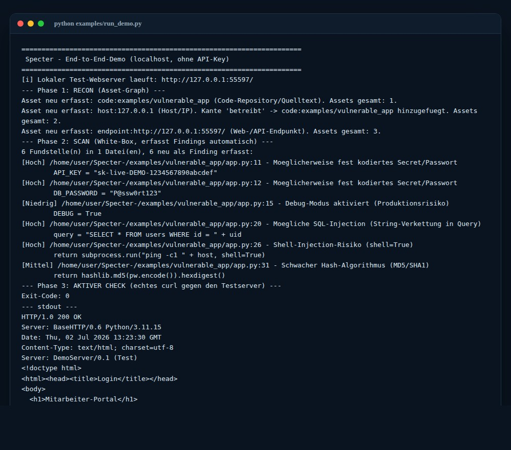
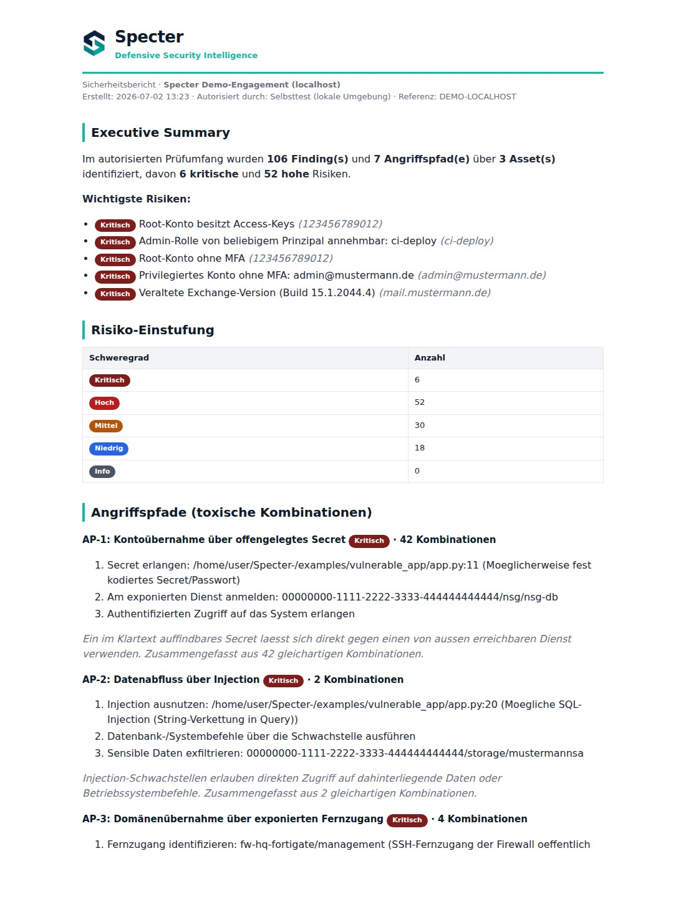
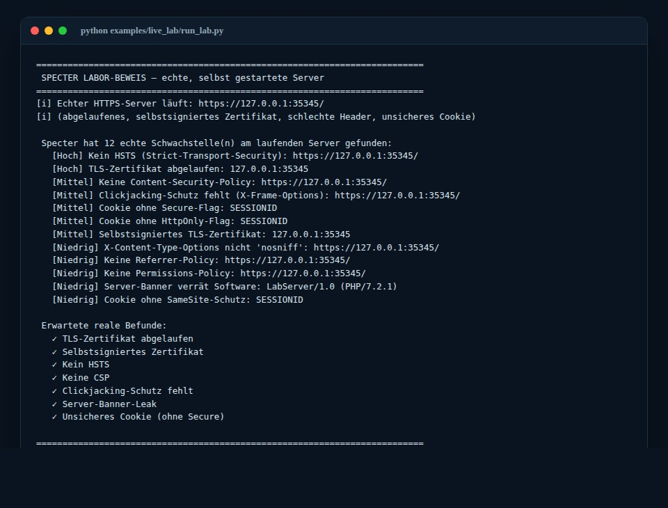

<p align="center">
  <picture>
    <source media="(prefers-color-scheme: dark)" srcset="docs/brand/specter-logo-white-transparent.png">
    
  </picture>
</p>

<p align="center"><strong>Defensive Security Intelligence — automatische IT-Sicherheitsprüfung für den Mittelstand.</strong></p>

<p align="center">
  
  
  
  
</p>

<p align="center">
  
</p>

> Specter deckt die Schwachstellen auf, über die im Mittelstand **wirklich** Schäden entstehen — E-Mail-Betrug, offenes RDP, fehlende Backups — und erklärt sie verständlich. **Rein defensiv:** keine Angriffe, kein Eingriff in fremde Systeme, nur im schriftlich vereinbarten Rahmen (§ 202 StGB).

---

## Was ist Specter?

Specter ist ein **automatischer, defensiver Sicherheits-Prüfer**. Man kann sich das
wie einen **TÜV für die IT** vorstellen: Er schaut sich die IT einer Firma an, findet
Schwachstellen und schreibt einen verständlichen Bericht mit klaren Prioritäten — so
wie es große Sicherheitsfirmen tun, nur schneller und günstiger.

Das Besondere: Specter arbeitet **offline**. Er wertet Export-Dateien aus, die der
Kunde bereitstellt, und öffentliche Daten (z. B. DNS-Einträge). Er verbindet sich
nicht heimlich mit fremden Systemen und verändert dort nichts. Das macht ihn sicher —
und rechtlich sauber.

## So sieht es aus

**Der End-to-End-Lauf im Terminal** (echte Ausgabe der mitgelieferten Demo):

<p align="center"></p>

**Der fertige Bericht** (markengerechtes HTML, per Browser-Druck als PDF an den Kunden):

<p align="center"></p>

---

## Gegen echte Server geprüft

Specter wird nicht nur an Fixtures getestet, sondern gegen **echte, selbst
gestartete Server**: Das Labor-Harness mintet ein echtes (abgelaufenes,
selbstsigniertes) TLS-Zertifikat, startet damit einen echten HTTPS-Server mit
absichtlich fehlenden Sicherheits-Headern und einem unsicheren Cookie, greift ihn
real ab (`curl` + `openssl`) und prüft, dass Specter die Schwachstellen findet.

```bash
python examples/live_lab/run_lab.py
```

<p align="center"></p>

Denselben Live-Check kannst du gegen eine **eigene, freigegebene Domain oder einen
eigenen Server** laufen lassen (nur eigene/freigegebene Systeme — §202 StGB):

```bash
python examples/live_web_check.py meine-domain.de
```

Und gegen eine **echte, selbst gestartete Datenbank**: das DB-Labor startet einen
echten, nicht authentifizierten Redis-Dienst (echter `redis:alpine`-Container,
sonst ein echter lokaler Socket-Dienst als Fallback), verbindet sich real per
Socket und prüft, dass Specter den offenen, ungeschützten Datenbank-Port erkennt:

```bash
python examples/live_lab/run_db_lab.py
```

Und gegen eine **echte Container-Konfiguration**: das Container-Labor erfasst per
`docker inspect` die echte Konfiguration eines absichtlich unsicheren Containers
(privilegiert, `docker.sock` gemountet, Host-Networking) und prüft, dass Specter
die gefährlichen Fehlkonfigurationen erkennt:

```bash
python examples/live_lab/run_container_lab.py
```

---

## Schnellstart

Einmalig einrichten:

```bash
git clone https://github.com/BEKO2210/Specter-.git
cd Specter-
pip install -r requirements.txt
```

**1) Demo ansehen** — kompletter Ablauf gegen einen lokalen Test-Server, völlig gefahrlos:

```bash
python examples/run_demo.py
```

**2) Live-Check einer echten Domain** — der kostenlose Türöffner (nur öffentliche DNS-Daten):

```bash
python examples/live_email_check.py kunde-domain.de
```

**3) Tests laufen lassen** — 603 Tests, 100 % Coverage:

```bash
pip install -r requirements-dev.txt
python -m pytest
```

---

## Schritt für Schritt: dein erster Kundenauftrag

> 📘 **Ausführlich mit Erklärungen im Handbuch:** [**Specter-Handbuch.pdf**](docs/Specter-Handbuch.pdf)
> (erzeugen/aktualisieren mit `python examples/build_handbook.py`).

1. **Türöffner senden.** Läuft den Live-Check für die Domain des Interessenten und
   nutze das Ergebnis als Aufhänger für den Erstkontakt:
   ```bash
   python examples/live_email_check.py kunde-domain.de
   python examples/build_outreach_email.py kunde-domain.de "Belkis Aslani" belkis.aslani@gmail.com
   ```
2. **Rahmen festlegen.** Trage die erlaubten Ziele/Pfade in eine `scope.yaml` ein
   (Vorlage: `scope.example.yaml`). **Nur was hier steht, wird geprüft** — alles andere
   verweigert Specter automatisch.
3. **Kundendaten sammeln.** Bitte die IT um harmlose **Export-Dateien** (JSON): E-Mail-/
   DNS-Einträge, Microsoft-365-/AD-Export, Firewall-Regeln, Backup-Fragebogen … In
   `examples/data/` liegt für jeden Bereich eine Beispieldatei zum Zeigen.
4. **Prüfen.** Ohne KI-Schlüssel laufen die Analyzer direkt; mit Schlüssel steuert das
   KI-Modell den Ablauf:
   ```bash
   python main.py --scope scope.yaml --objective "Pruefe die Exporte in ./kundendaten"
   ```
5. **Bericht & PDF.** Specter schreibt Markdown-, JSON- und einen schönen HTML-Bericht.
   HTML im Browser öffnen → **Drucken → Als PDF speichern** → fertiges Kunden-PDF.
6. **Angebot & Abschluss.** Angebots-One-Pager erzeugen und mitschicken:
   ```bash
   python examples/build_offer.py "Kunde GmbH" belkis.aslani@gmail.com
   ```
7. **Nachtest.** Nach der Behebung erneut prüfen — der Bericht zeigt, was jetzt
   geschlossen ist.

---

## Was Specter prüft

Vierzehn Offline-Analyzer decken die Bereiche ab, die im Mittelstand wirklich zählen:

| Bereich | Findet u. a. |
|---|---|
| **E-Mail-Schutz** | SPF, DKIM, DMARC gegen Spoofing & CEO-Fraud |
| **DNS-Sicherheit** | fehlendes DNSSEC, fehlende CAA, offener Zonentransfer (AXFR), dangling CNAME |
| **Web-Sicherheit** | fehlende HTTP-Header (HSTS/CSP/X-Frame), unsichere Cookies, Banner-Leaks |
| **Datenbanken** | öffentlich erreichbare DB-Ports, fehlende Authentifizierung (Redis/Mongo), Default-Creds, Transport ohne TLS |
| **Container/Docker** | privilegierte Container, gemountetes docker.sock, Host-Networking, gefährliche Capabilities, Lauf als root, `:latest` |
| **Active Directory** | schwache Policies, Kerberoasting, Golden-Ticket-Risiken |
| **Microsoft 365 / Entra** | fehlende MFA, Legacy-Auth, zu viele Admins, offene Freigaben |
| **AWS** | Root ohne MFA, offene S3-Buckets, zu weite Rechte |
| **Azure** | öffentliche Speicher, offene Ports, alte VMs, ungeschützte Key Vaults |
| **Firewall & VPN** | Any-Any-Regeln, offenes RDP/SSH, VPN ohne MFA |
| **TLS & Zertifikate** | abgelaufen, schwache Cipher, alte Protokolle |
| **Abhängigkeiten (SCA)** | bekannte Lücken (Log4Shell-Klasse), veraltete Pakete |
| **Exchange** | veraltete Versionen, exponierte Dienste |
| **Backup-Resilienz** | 3-2-1-Regel, Immutable-Backups, getestete Restores |

Dazu: automatische **Angriffspfad-Analyse**, **Choke-Points**, ein **CVSS-Score** je
Fund, **BSI-IT-Grundschutz**-Zuordnung und ein **Nachtest** (Delta gegen den letzten Bericht).

---

## Sicherheit & Recht (die goldene Regel)

Eine Prüfung darf nie selbst zum Risiko werden. Deshalb ist Specter von Grund auf
defensiv gebaut:

- **Offline & lesend** — nur bereitgestellte/öffentliche Daten, keine Live-Verbindung.
- **Keine Ausnutzung** — kein Passwortknacken, keine Rechteausweitung, kein DoS, keine Persistenz.
- **Fail-closed Scope** — alles außerhalb der `scope.yaml` wird technisch verweigert.
- **Aktive Scanner standardmäßig aus** — nmap/nikto nur mit ausdrücklicher Freigabe (Human-in-the-loop).
- **Vollständiges Audit-Log** — jede Aktion ist nachweisbar.
- **Nur mit schriftlicher Beauftragung** — im vereinbarten Rahmen (§ 202a-c StGB), DSGVO-konform.

Siehe auch [`SECURITY.md`](SECURITY.md).

---

## Verkaufs-Kit (fertig zum Einsatz)

| Werkzeug | Zweck | Befehl |
|---|---|---|
| **Website** | Online-Auftritt (GitHub Pages) | `docs/index.html` |
| **Handbuch** | dein Lern-/Bedienheft (PDF) | `python examples/build_handbook.py` |
| **Live-Check** | kostenloser Türöffner | `python examples/live_email_check.py <domain>` |
| **Erstkontakt-Mail** | individuelle Ansprache | `python examples/build_outreach_email.py <domain>` |
| **Angebot** | Pakete & Preise | `python examples/build_offer.py` |
| **Akquiseplan** | wen & wie ansprechen | `python examples/build_acquisition_plan.py` |
| **Vertrauens-One-Pager** | Kunden überzeugen | `python examples/build_trust_onepager.py` |

**Website veröffentlichen:** GitHub → *Settings → Pages → Deploy from a branch →
`main` / `/docs`*. Danach live unter `https://beko2210.github.io/specter-/`.

---

## Qualität

**603 Tests, 100 % Code-Coverage** (per `pytest.ini` als Gate erzwungen,
`--cov-fail-under=100`), CI auf Python 3.11 und 3.12. Abgedeckt sind u. a. Scope-
Durchsetzung (Pfad-Traversal, CIDR, Sperrliste), alle vierzehn Analyzer (jede Regel +
Fehlerfälle), die vierundzwanzig Werkzeuge, Angriffspfad-/Choke-Point-Analyse, CVSS-Lite,
BSI-Mapping sowie Markdown- und HTML-Report.

---

## Projektstruktur (Auszug)

```
specter/            # Kern: Analyzer, Tools, Scope-Policy, Report, CVSS, BSI
  analyzers/        # die vierzehn Offline-Analyzer
  tools/            # vierundzwanzig Agenten-Werkzeuge
examples/           # Demo, Live-Check, Marketing-Generatoren, Beispieldaten
docs/               # Website (GitHub Pages), Marke, Handbuch-PDF
tests/              # 603 Tests (100 % Coverage)
```

---

<p align="center"><sub>Specter — defensive, autorisierte Sicherheitsprüfung. Personenbezogene Daten sind gemäß DSGVO und BSI IT-Grundschutz zu schützen.</sub></p>
